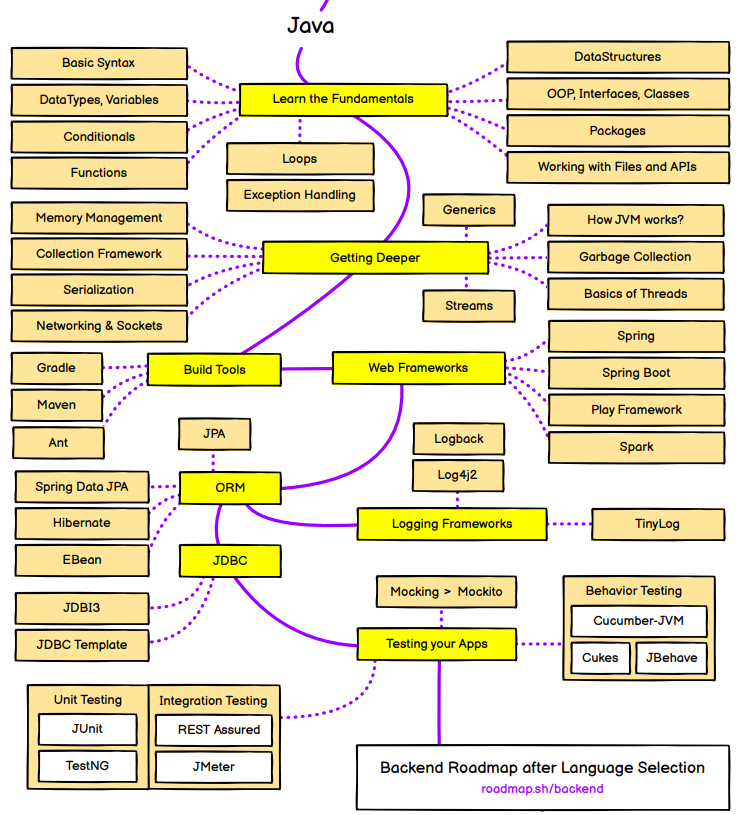

# Java-Harder-Way

Concepts update soon 


```
Java Core
Spring
Spring_Boot
Maven 
Dockerization
Deployment --- Render
Testing    --- Cypress, TestNG, Selenium
Maintainence
Logging
etc..

```



<embed src="./docs/java.pdf" type="application/pdf" width="100%" height="600px" />


- [ ] This is an unchecked checkbox
- [x] This is a checked checkbox


- [ ] Core
- [ ] Build Tools --- Maven 
- [ ] Web FrameWork -- Spring, SpringBoot
- [ ] ORM   -- Hibernate
- [ ] Logging Framework
- [ ] JDBC
- [ ] Unit Testing - TestNG
- [ ] Integrated Testing - JMeter, Cypress
- [ ] Behaviour Testing - Cucumber - JVM, Mockito
